## Overview

Brane provides a layered architecture separating client APIs from transport providers.

```mermaid
%%{init: {'flowchart': {'nodeSpacing': 30, 'rankSpacing': 50}}}%%
flowchart TD
    APP["🖥️ USER APPLICATION"]

    subgraph BRANE["Brane (sealed interface)"]
        direction LR
        READER["Brane.Reader<br/><i>read-only operations</i>"] ~~~ SIGNER["Brane.Signer<br/><i>read + write operations</i>"]
    end

    subgraph IMPLS["Implementations"]
        direction LR
        DEFAULT_READER["DefaultReader<br/><i>implements Reader</i>"] ~~~ DEFAULT_SIGNER["DefaultSigner<br/><i>implements Signer</i>"]
    end

    subgraph PROVIDER["BraneProvider (interface)"]
        direction LR
        HTTP["HttpBraneProvider<br/>• HttpClient<br/>• Stateless"] ~~~ WS["WebSocketProvider<br/>• Netty / Disruptor<br/>• Subscriptions"]
    end

    NODE["⛓️ ETHEREUM NODE (JSON-RPC)"]

    APP --> BRANE
    BRANE --> IMPLS
    DEFAULT_SIGNER -.->|delegates to| DEFAULT_READER
    IMPLS --> PROVIDER
    PROVIDER --> NODE
```

## Client Layer

The `Brane` sealed interface is the main entry point:

- **`Brane.Reader`** - Read-only operations: balance queries, block fetching, `eth_call`, event logs
- **`Brane.Signer`** - All Reader operations plus transaction signing and sending

`DefaultSigner` delegates read operations to an internal `DefaultReader` instance.

## Provider Layer

`BraneProvider` abstracts the transport mechanism:

| Provider | Use Case |
|----------|----------|
| `HttpBraneProvider` | Standard request/response, stateless, serverless-friendly |
| `WebSocketProvider` | Real-time subscriptions, persistent connection |

## Module Dependencies

```mermaid
flowchart TD
    PRIMITIVES["📦 brane-primitives<br/><i>no dependencies</i>"]
    CORE["📦 brane-core<br/><i>BouncyCastle, Jackson</i>"]
    RPC["📦 brane-rpc<br/><i>Netty, Disruptor</i>"]
    CONTRACT["📦 brane-contract"]

    PRIMITIVES --> CORE --> RPC --> CONTRACT
```

