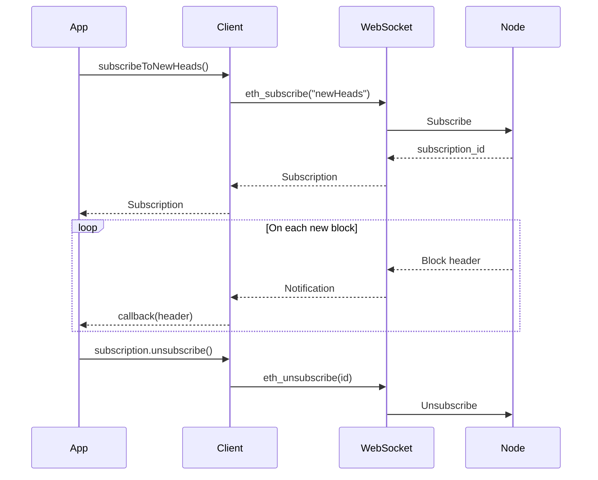

Brane provides type-safe subscriptions for real-time blockchain events over WebSocket.

<Warning>
Subscriptions require a WebSocket provider. HTTP providers do not support `eth_subscribe`.
</Warning>

## Setup

```java
import io.brane.rpc.WebSocketProvider;
import io.brane.rpc.PublicClient;

var provider = WebSocketProvider.create("wss://ethereum.publicnode.com");
var client = PublicClient.from(provider);
```

---

## Subscribe to New Blocks

Get notified when new blocks are mined:

```java
import io.brane.rpc.Subscription;
import io.brane.core.model.BlockHeader;

Subscription subscription = client.subscribeToNewHeads(header -> {
    System.out.println("New block #" + header.number());
    System.out.println("  Hash: " + header.hash());
    System.out.println("  Timestamp: " + header.timestamp());
    
    if (header.baseFeePerGas() != null) {
        System.out.println("  Base Fee: " + header.baseFeePerGas().value() + " wei");
    }
});

// Keep running...
Thread.sleep(60_000);

// Unsubscribe when done
subscription.unsubscribe();
```

### BlockHeader Fields

| Field | Type | Description |
|-------|------|-------------|
| `hash()` | `Hash` | Block hash |
| `number()` | `Long` | Block number |
| `parentHash()` | `Hash` | Parent block hash |
| `timestamp()` | `Long` | Unix timestamp |
| `baseFeePerGas()` | `Wei` | EIP-1559 base fee (null for pre-London) |

---

## Subscribe to Logs

Monitor contract events in real-time:

```java
import io.brane.rpc.LogFilter;
import io.brane.rpc.Subscription;
import io.brane.core.model.LogEntry;
import io.brane.core.types.Address;
import io.brane.core.types.Hash;
import java.util.List;

// USDC contract on Ethereum mainnet
Address usdc = new Address("0xA0b86991c6218b36c1d19D4a2e9Eb0cE3606eB48");

// Transfer(address,address,uint256) event signature
Hash transferTopic = new Hash("0xddf252ad1be2c89b69c2b068fc378daa952ba7f163c4a11628f55a4df523b3ef");

// Use the byContract factory method
LogFilter filter = LogFilter.byContract(usdc, List.of(transferTopic));

Subscription subscription = client.subscribeToLogs(filter, log -> {
    System.out.println("Transfer detected!");
    System.out.println("  Tx: " + log.transactionHash());
    System.out.println("  From: " + log.topics().get(1));  // indexed param
    System.out.println("  To: " + log.topics().get(2));    // indexed param
    System.out.println("  Data: " + log.data());           // amount (encoded)
});
```

### LogEntry Fields

| Field | Type | Description |
|-------|------|-------------|
| `address()` | `Address` | Contract address |
| `data()` | `HexData` | Non-indexed event data |
| `topics()` | `List<Hash>` | Event signature + indexed parameters |
| `transactionHash()` | `Hash` | Transaction that emitted the log |
| `blockHash()` | `Hash` | Block containing the log |
| `logIndex()` | `int` | Log index in the block |
| `removed()` | `boolean` | True if log was reverted (reorg) |

---

## Subscribe to Pending Transactions

<Warning>
Not all nodes support `newPendingTransactions`. Public RPC endpoints often disable it due to high volume.
</Warning>

Monitor the mempool for new pending transactions:

```java
// Use the low-level provider API for pending transactions
String subscriptionId = provider.subscribe("newPendingTransactions", null, event -> {
    String txHash = event.toString();
    System.out.println("Pending tx: " + txHash);
});

// Later, unsubscribe
provider.unsubscribe(subscriptionId);
```

---

## Managing Subscriptions

### Unsubscribe

Always unsubscribe when done to free resources:

```java
Subscription sub = client.subscribeToNewHeads(header -> { ... });

// When done
sub.unsubscribe();
```

### Multiple Subscriptions

You can have multiple subscriptions on the same connection:

```java
var blockSub = client.subscribeToNewHeads(header -> { ... });
var logSub = client.subscribeToLogs(filter, log -> { ... });

// Both run concurrently on the same WebSocket connection
```

### Subscription Lifecycle



---

## Callback Threading

By default, callbacks run on **virtual threads** to prevent blocking the Netty I/O thread.

### Custom Executor

For CPU-intensive callbacks or custom threading:

```java
import java.util.concurrent.Executors;

// Run callbacks on a fixed thread pool
provider.setSubscriptionExecutor(
    Executors.newFixedThreadPool(4)
);
```

<Warning>
Never block in callbacks if using the default executor or Netty I/O thread. Use `setSubscriptionExecutor()` for heavy processing.
</Warning>

---

## Error Handling

### Reorgs (Chain Reorganization)

When a reorg occurs, logs may be marked as `removed`:

```java
client.subscribeToLogs(filter, log -> {
    if (log.removed()) {
        System.out.println("Log reverted due to reorg: " + log.transactionHash());
        // Handle revert - e.g., undo state change
        return;
    }
    
    // Process normally
});
```

### Connection Loss

If the WebSocket connection drops, subscriptions are lost. Re-subscribe after reconnection:

```java
// The provider handles reconnection automatically,
// but you need to re-subscribe
try {
    var sub = client.subscribeToNewHeads(callback);
} catch (RpcException e) {
    // Retry logic
}
```

---

## Best Practices

1. **Always unsubscribe** — Prevents resource leaks on both client and server.

2. **Handle reorgs** — Check `log.removed()` for critical applications.

3. **Don't block callbacks** — Use the subscription executor for heavy work.

4. **Use try-with-resources for provider** — Ensures cleanup:
   ```java
   try (var provider = WebSocketProvider.create("wss://...")) {
       var client = PublicClient.from(provider);
       var sub = client.subscribeToNewHeads(callback);
       // ...
   } // Provider closes, subscriptions cleaned up
   ```

5. **Filter precisely** — The more specific your `LogFilter`, the less data transferred.
